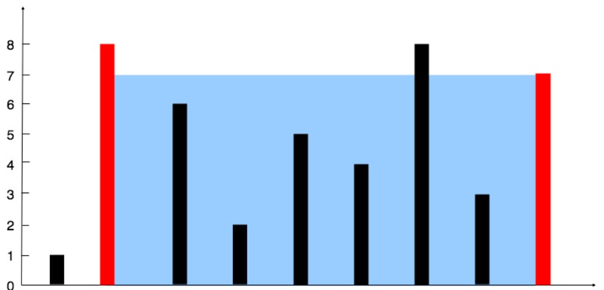

# 一. 哈希

## 两数之和

给定一个整数数组 `nums` 和一个整数目标值 `target`，请你在该数组中找出 **和为目标值** *target*  的那 **两个** 整数，并返回它们的数组下标。

你可以假设每种输入只会对应一个答案，并且你不能使用两次相同的元素。

你可以按任意顺序返回答案。

**示例 1：**

输入：nums = [2,7,11,15], target = 9
输出：[0,1]
解释：因为 nums[0] + nums[1] == 9 ，返回 [0, 1] 

**解答：**

经典的键，值一一对应

核心：$need = target -nums[i]$

cpp：

```cpp
class Solution {
  public:
    vector<int> twoSum(vector<int> &nums, int target) {
        unordered_map<int, int> mp;
        for (int i = 0; i < nums.size(); i++) {
            auto ip = mp.find(target - nums[i]);
            if (ip != mp.end())
                return {ip->second, i};
            mp.insert({nums[i], i});
        }
        return {};
    }
};
```

java：

```java
class Solution {
    public int[] twoSum(int[] nums, int target) {
        Map<Integer, Integer> pos = new HashMap<>();
        for (int i = 0; i < nums.length; i++) {
            int need = target - nums[i];
            if (pos.containsKey(need)) {
                return new int[] { pos.get(need), i };
            }
            pos.put(nums[i], i);
        }
        return new int[0];
    }
}
```

## 字母异位词分组

给你一个字符串数组，请你将 字母异位词 组合在一起。可以按任意顺序返回结果列表。

**示例 1:**

**输入:** strs = ["eat", "tea", "tan", "ate", "nat", "bat"]

**输出:** [["bat"],["nat","tan"],["ate","eat","tea"]]

**解释：**

- 在 strs 中没有字符串可以通过重新排列来形成 `"bat"`。
- 字符串 `"nat"` 和 `"tan"` 是字母异位词，因为它们可以重新排列以形成彼此。
- 字符串 `"ate"` ，`"eat"` 和 `"tea"` 是字母异位词，因为它们可以重新排列以形成彼此。
- `strs[i]` 仅包含小写字母

**解答：**

对于每个字符串，把它的字符排序，排序后的结果作为键，相同键的字符串放在同一个数组里即可

cpp：

```cpp
class Solution {
  public:
    vector<vector<string>> groupAnagrams(vector<string> &strs) {
        unordered_map<string, vector<string>> mp;
        for (auto &s : strs) {
            string key = s;
            sort(key.begin(), key.end());
            mp[key].push_back(s);
        }
        vector<vector<string>> ans;
        ans.reserve(mp.size());
        for (auto &k : mp)
            ans.push_back(move(k.second));
        return ans;
    }
};
```

java：

```java
class Solution {
    public List<List<String>> groupAnagrams(String[] strs) {
        Map<String, List<String>> map = new HashMap<String, List<String>>();
        for (String str : strs) {
            char[] array = str.toCharArray();
            Arrays.sort(array);
            String key = new String(array);
            List<String> list = map.getOrDefault(key, new ArrayList<String>());
            list.add(str);
            map.put(key, list);
        }
        return new ArrayList<List<String>>(map.values());
    }
}
```

## 最长连续序列

给定一个未排序的整数数组 `nums` ，找出数字连续的最长序列（不要求序列元素在原数组中连续）的长度。

请你设计并实现时间复杂度为 `O(n)` 的算法解决此问题。

**示例 1：**

输入：nums = [100,4,200,1,3,2]
输出：4
解释：最长数字连续序列是 [1, 2, 3, 4]。它的长度为 4

**解答：**

连续最长序列，显然使用set来去重比较好

如何判断 x 是否可以作为“某一段连续序列的起点”？

​	**如果 x - 1 不在集合中，说明不存在比 x 更小的、且能和 x 连起来的数字**，那么这个x就可以作为起点使用

cpp：

```cpp
class Solution {
  public:
    int longestConsecutive(vector<int> &nums) {
        if (nums.empty())
            return 0;
        unordered_set<int> sn;
        sn.reserve(nums.size() * 2);
        sn.max_load_factor(0.7f);
        for (int x : nums)
            sn.insert(x);
        int ans = 0;
        for (auto &i : sn) {
            if (!sn.count(i - 1)) {
                int tmp = i;
                int len = 1;
                while (sn.count(tmp + 1)) {
                    tmp++;
                    len++;
                }
                ans = max(ans, len);
            }
        }
        return ans;
    }
};
```

java：

```java
class Solution {
    public int longestConsecutive(int[] nums) {
        Set<Integer> num_set = new HashSet<Integer>();
        for (int num : nums) {
            num_set.add(num);
        }

        int longestStreak = 0;

        for (int num : num_set) {
            if (!num_set.contains(num - 1)) {
                int currentNum = num;
                int currentStreak = 1;

                while (num_set.contains(currentNum + 1)) {
                    currentNum += 1;
                    currentStreak += 1;
                }

                longestStreak = Math.max(longestStreak, currentStreak);
            }
        }

        return longestStreak;
    }
}
```

# 二. 双指针

## 移动零

给定一个数组 `nums`，编写一个函数将所有 `0` 移动到数组的末尾，同时保持非零元素的相对顺序。

**请注意** ，必须在不复制数组的情况下原地对数组进行操作。

**示例 1:**

输入: nums = [0,1,0,3,12]
输出: [1,3,12,0,0]

**解答：**

快指针 i 遍历数组，寻找非0元素，将它与0交换，慢指针 j 指向“0”，或者说指向“**下一个应该放非0元素的位置**”

1.怎么知道 j 初始指向哪？	不需要知道，令 j 初始为0即可：

​	（1）当初始 j 指向0，显然没有问题，等待 i 找到非0元素进行交换

​	（2）若初始 j 指向 非0，那么由于 i 初始也指向了非0元素，所以 i == j，不进行交换，j++寻找“0”，直到 i 与 j 不同

2.为什么j++就一定指向了“**下一个应该放非0元素的位置**”？	两种情况：

​	（1）[0, 0, 1]，j从0 -> 1，i从 2 -> 3，j 依旧指向“0”

​	（2）[0, 1, 2]，j从0 -> 1，此时[1]的位置被交换成了“0”，j 依旧指向“0”

cpp：

```cpp
class Solution {
  public:
    void moveZeroes(vector<int> &nums) {
        int j = 0;
        for (int i = 0; i < nums.size(); i++) {
            if (nums[i] != 0) {
                if (i != j)
                    swap(nums[i], nums[j]);
                j++;
            }
        }
    }
};
```

java：

```java
class Solution {
    public void moveZeroes(int[] nums) {
        int n = nums.length, left = 0, right = 0;
        while (right < n) {
            if (nums[right] != 0) {
                swap(nums, left, right);
                left++;
            }
            right++;
        }
    }

    public void swap(int[] nums, int left, int right) {
        int temp = nums[left];
        nums[left] = nums[right];
        nums[right] = temp;
    }
}
```

## 盛最多水的容器

给定一个长度为 `n` 的整数数组 `height` 。有 `n` 条垂线，第 `i` 条线的两个端点是 `(i, 0)` 和 `(i, height[i])` 。

找出其中的两条线，使得它们与 `x` 轴共同构成的容器可以容纳最多的水。

返回容器可以储存的最大水量。

**说明：**你不能倾斜容器。

**示例 1：**



输入：[1,8,6,2,5,4,8,3,7]
输出：49 
解释：图中垂直线代表输入数组 [1,8,6,2,5,4,8,3,7]。在此情况下，容器能够容纳水（表示为蓝色部分）的最大值为 49

**解答：**

选择第 i 根和第 j 根柱子（i < j），那么面积$S = min(i, j) ✖ (j - i)$，显然影响条件取决于$j - i$和$min(i, j)$

可以先让一个条件处于最大值，在慢慢变动另一个值，使得最终值最大

宽度最大值显然比高度好找，那么就设左指针 `l = 0`，右指针 `r = n - 1`，当前这两根柱子之间的面积是

`min(height[l], height[r]) * (r - l)`

接下来怎么更改 i 或者 j 的值呢？

​	显然移动高度较小的那一侧指针就行

cpp：

```cpp
class Solution {
  public:
    int maxArea(vector<int> &height) {
        int j = height.size() - 1;
        int i = 0;
        int ans = 0;
        while (i < j) {
            int s = min(height[i], height[j]) * (j - i);
            ans = max(ans, s);
            if (height[i] <= height[j])
                i++;
            else
                j--;
        }
        return ans;
    }
};
```

java：

```java
public class Solution {
    public int maxArea(int[] height) {
        int l = 0, r = height.length - 1;
        int ans = 0;
        while (l < r) {
            int area = Math.min(height[l], height[r]) * (r - l);
            ans = Math.max(ans, area);
            if (height[l] <= height[r]) {
                ++l;
            }
            else {
                --r;
            }
        }
        return ans;
    }
}
```

## 三数之和

给你一个整数数组 `nums` ，判断是否存在三元组 `[nums[i], nums[j], nums[k]]` 满足 `i != j`、`i != k` 且 `j != k` ，同时还满足 `nums[i] + nums[j] + nums[k] == 0` 。请你返回所有和为 `0` 且不重复的三元组。

**注意：**答案中不可以包含重复的三元组

**示例 1：**

输入：nums = [-1,0,1,2,-1,-4]
输出：[[-1,-1,2],[-1,0,1]]
解释：
nums[0] + nums[1] + nums[2] = (-1) + 0 + 1 = 0 
nums[1] + nums[2] + nums[4] = 0 + 1 + (-1) = 0 
nums[0] + nums[3] + nums[4] = (-1) + 2 + (-1) = 0 
不同的三元组是 [-1,0,1] 和 [-1,-1,2] 
注意，输出的顺序和三元组的顺序并不重要

**示例 2：**

输入：nums = [0,1,1]
输出：[]
解释：唯一可能的三元组和不为 0 

**解答：**

先对数组进行升序排序，排序后，固定第一个数 nums[i]，在它右侧用一对指针 left 和 right 做「两数之和为 target」的查找，其中 target = -nums[i]。
由于数组已排序，可以用双指针：如果 nums[left] + nums[right] < target，说明和太小，left++；如果和太大，right--；如果刚好等于 target，就得到一个满足条件的三元组。为了去重，需要在三个位置做跳过相同元素的处理。

去重：
一是外层 i 循环，如果 nums[i] 和前一个数相同，则直接 continue，避免同一个起点重复计算。
二是当找到一个满足条件的三元组后，向内移动 left、right 时，要跳过所有与当前值相同的元素，否则会产生重复三元组。

cpp：

```cpp
class Solution {
  public:
    vector<vector<int>> threeSum(vector<int> &nums) {
        vector<vector<int>> ans;
        int n = nums.size();
        if (n < 3)
            return ans;
        sort(nums.begin(), nums.end());
        // 最大的数都大于0了，就没必要比较了
        if (nums[0] > 0)
            return ans;
        for (int i = 0; i < n - 2; i++) {
            // 如果和前一个数相同，则跳过，避免同样的起点重复
            if (i > 0 && nums[i] == nums[i - 1])
                continue;
            // 内循环
            int l = i + 1;
            int r = n - 1;
            while (l < r) {
                long long sum = (long long)nums[i] + nums[l] + nums[r];
                // sum == 0
                if (!sum) {
                    ans.push_back({nums[i], +nums[l], nums[r]});
                    // 分别对内循环进行去重
                    int lt = nums[l];
                    while (l < r && nums[l] == lt)
                        l++;
                    int rt = nums[r];
                    while (l < r && nums[r] == rt)
                        r--;
                } else if (sum < 0)
                    l++;
                else
                    r--;
            }
        }
        return ans;
    }
};
```

java：

```java
class Solution {
    public List<List<Integer>> threeSum(int[] nums) {
        int n = nums.length;
        Arrays.sort(nums);
        List<List<Integer>> ans = new ArrayList<List<Integer>>();
        // 枚举 a
        for (int first = 0; first < n; ++first) {
            // 需要和上一次枚举的数不相同
            if (first > 0 && nums[first] == nums[first - 1]) {
                continue;
            }
            // c 对应的指针初始指向数组的最右端
            int third = n - 1;
            int target = -nums[first];
            // 枚举 b
            for (int second = first + 1; second < n; ++second) {
                // 需要和上一次枚举的数不相同
                if (second > first + 1 && nums[second] == nums[second - 1]) {
                    continue;
                }
                // 需要保证 b 的指针在 c 的指针的左侧
                while (second < third && nums[second] + nums[third] > target) {
                    --third;
                }
                // 如果指针重合，随着 b 后续的增加
                // 就不会有满足 a+b+c=0 并且 b<c 的 c 了，可以退出循环
                if (second == third) {
                    break;
                }
                if (nums[second] + nums[third] == target) {
                    List<Integer> list = new ArrayList<Integer>();
                    list.add(nums[first]);
                    list.add(nums[second]);
                    list.add(nums[third]);
                    ans.add(list);
                }
            }
        }
        return ans;
    }
}
```

## 接雨水

给定 `n` 个非负整数表示每个宽度为 `1` 的柱子的高度图，计算按此排列的柱子，下雨之后能接多少雨水。

**示例 1：**


输入：height = [0,1,0,2,1,0,1,3,2,1,2,1]
输出：6
解释：上面是由数组 [0,1,0,2,1,0,1,3,2,1,2,1] 表示的高度图，在这种情况下，可以接 6 个单位的雨水（蓝色部分表示雨水）

**解答**：

对于每根柱子 i，它**上方**能接多少水，取决于它左边最高柱子高度 `leftMax[i]`，和右边最高柱子高度 `rightMax[i]`，当前位置 i 能装水的容量（其实就是高度）是：

$wateri=min⁡(leftMax[i],rightMax[i])−height[i]$

如果这个值是正的，就能接这么多水；如果是负的或零，就接不到水

用两个指针 `l` 和 `r`，分别指向数组两端，维护

- `leftMax`：从左到当前 l 位置的最大高度
- `rightMax`：从右到当前 r 位置的最大高度

核心逻辑是：

1. 每次比较 `height[l]` 和 `height[r]`
2. 如果 `height[l] <= height[r]`，那么此时左侧的最高柱子 `leftMax` 一定不大于右侧的某个最高柱子 `rightMax`，
   因此位置 `l` 的水量完全由 `leftMax` 决定，右边再高也不影响
   - 如果 `height[l] >= leftMax`，更新 `leftMax = height[l]`，当前位置装不到水
   - 否则当前位置能装 `leftMax - height[l]` 的水
     然后 `l++`，向右推进
3. 反之，如果 `height[l] > height[r]`，就对右指针做对称处理：
   用 `rightMax` 决定 `r` 位置的水量，然后 `r--`

cpp：

```cpp
class Solution {
  public:
    int trap(vector<int> &height) {
        int n = height.size();
        if (n <= 2)
            return 0; // 少于 3 根柱子肯定接不到水
        int l = 0;        // 左指针
        int r = n - 1;    // 右指针
        int leftMax = 0;  // 从左边走到当前位置的最高柱子
        int rightMax = 0; // 从右边走到当前位置的最高柱子
        int ans = 0;      // 记录总水量

        while (l < r) {
            // 谁矮，谁那一侧的水量就可以确定
            if (height[l] <= height[r]) {
                // 更新左侧最高高度
                if (height[l] >= leftMax) {
                    leftMax = height[l];
                } else {
                    // 左侧能接的水 = leftMax - 当前高度
                    ans += leftMax - height[l];
                }
                ++l; // 左指针右移
            } else {
                // 更新右侧最高高度
                if (height[r] >= rightMax) {
                    rightMax = height[r];
                } else {
                    // 右侧能接的水 = rightMax - 当前高度
                    ans += rightMax - height[r];
                }
                --r; // 右指针左移
            }
        }
        return ans;
    }
};
```

java：

```java
class Solution {
    public int trap(int[] height) {
        int ans = 0;
        int left = 0, right = height.length - 1;
        int leftMax = 0, rightMax = 0;
        while (left < right) {
            leftMax = Math.max(leftMax, height[left]);
            rightMax = Math.max(rightMax, height[right]);
            if (height[left] < height[right]) {
                ans += leftMax - height[left];
                ++left;
            } else {
                ans += rightMax - height[right];
                --right;
            }
        }
        return ans;
    }
}
```

# 三. 滑动窗口

## 无重复字符的最长字串

给定一个字符串 `s` ，请你找出其中不含有重复字符的 **最长 子串** 的长度。

**示例 1:**

输入: s = "abcabcbb"
输出: 3 
解释: 因为无重复字符的最长子串是 "abc"，所以其长度为 3。注意 "bca" 和 "cab" 也是正确答案

**解答：**

我们要找的是“最长的、没有重复字符的连续子串”。可以用一个窗口 `[left, right]` 表示当前考虑的子串：

1. 用 `right` 从左到右扫描字符串，把字符一个个加入窗口
2. 维护一个`map`，记录当前窗口中每个字符出现的次数（或是否出现过）
3. 每当加入一个字符 `s[right]` 后，如果这个字符在窗口里“出现次数 > 1”，说明出现了重复字符，窗口不合法：
   那就不断移动 `left`（收缩左边界），同时更新计数，直到窗口中每种字符最多只出现一次为止
4. 每次窗口变成合法时，用 `当前窗口长度 = right - left + 1` 更新答案

cpp：

```cpp
class Solution {
  public:
    int lengthOfLongestSubstring(string s) {
        unordered_map<char, int> cnt; // 统计当前窗口内各字符出现次数
        int n = s.size();
        int left = 0; // 窗口左边界
        int ans = 0;  // 记录最长长度
        for (int right = 0; right < n; ++right) {
            char c = s[right];
            cnt[c]++; // 把 s[right] 加入窗口
            // 如果当前字符出现次数大于 1，说明有重复，需要收缩左边界
            while (cnt[c] > 1) {
                char d = s[left];
                cnt[d]--; // 把 s[left] 移出窗口
                ++left;   // 左边界右移
            }
            // 此时窗口 [left, right] 内已经没有重复字符
            ans = max(ans, right - left + 1);
        }
        return ans;
    }
};
```

java：

```java
class Solution {
    public int lengthOfLongestSubstring(String s) {
        // 哈希集合，记录每个字符是否出现过
        Set<Character> occ = new HashSet<Character>();
        int n = s.length();
        // 右指针，初始值为 -1，相当于我们在字符串的左边界的左侧，还没有开始移动
        int rk = -1, ans = 0;
        for (int i = 0; i < n; ++i) {
            if (i != 0) {
                // 左指针向右移动一格，移除一个字符
                occ.remove(s.charAt(i - 1));
            }
            while (rk + 1 < n && !occ.contains(s.charAt(rk + 1))) {
                // 不断地移动右指针
                occ.add(s.charAt(rk + 1));
                ++rk;
            }
            // 第 i 到 rk 个字符是一个极长的无重复字符子串
            ans = Math.max(ans, rk - i + 1);
        }
        return ans;
    }
}
```

## 找到字符串中所有字母异位词

给定两个字符串 `s` 和 `p`，找到 `s` 中所有 `p` 的 **异位词** 的子串，返回这些子串的起始索引。不考虑答案输出的顺序。

**示例 1:**

输入: s = "cbaebabacd", p = "abc"
输出: [0,6]
解释:
起始索引等于 0 的子串是 "cba", 它是 "abc" 的异位词。
起始索引等于 6 的子串是 "bac", 它是 "abc" 的异位词。

**示例 2:**

输入: s = "abab", p = "ab"
输出: [0,1,2]
解释:
起始索引等于 0 的子串是 "ab", 它是 "ab" 的异位词。
起始索引等于 1 的子串是 "ba", 它是 "ab" 的异位词。
起始索引等于 2 的子串是 "ab", 它是 "ab" 的异位词。

**解答：**

cpp：

```cpp
class Solution {
  public:
    vector<int> findAnagrams(string s, string p) {
        vector<int> res;
        int n = s.size();
        int m = p.size();
        if (n < m)
            return res; // s 比 p 短，不可能有异位词
        // 统计模式串 p 中每个字符出现次数
        int cntP[26] = {0};
        for (char c : p) {
            cntP[c - 'a']++;
        }
        // 统计当前滑动窗口中的字符出现次数
        int cntW[26] = {0};
        // 先处理第一个长度为 m 的窗口 [0, m-1]
        for (int i = 0; i < m; ++i) {
            cntW[s[i] - 'a']++;
        }
        // 比较两个计数数组是否完全相同
        auto equal = [](int a[26], int b[]) {
            for (int i = 0; i < 26; i++)
                if (a[i] != b[i])
                    return false;
            return true;
        };
        // 如果第一个窗口已经是异位词，则记录起始下标 0
        if (equal(cntP, cntW)) {
            res.push_back(0);
        }
        // 继续向右滑动窗口：左边删一个字符，右边加一个字符
        for (int right = m; right < n; ++right) {
            int left = right - m; // 当前窗口的左端下标
            // 窗口右端加入 s[right]
            cntW[s[right] - 'a']++;
            // 窗口左端移除 s[left]
            cntW[s[left] - 'a']--;
            // 此时窗口为 [left + 1, right]，长度仍为 m
            if (equal(cntP, cntW)) {
                res.push_back(left + 1);
            }
        }
        return res;
    }
};
```

java：

```java
class Solution {
    public List<Integer> findAnagrams(String s, String p) {
        int sLen = s.length(), pLen = p.length();

        if (sLen < pLen) {
            return new ArrayList<Integer>();
        }

        List<Integer> ans = new ArrayList<Integer>();
        int[] count = new int[26];
        for (int i = 0; i < pLen; ++i) {
            ++count[s.charAt(i) - 'a'];
            --count[p.charAt(i) - 'a'];
        }

        int differ = 0;
        for (int j = 0; j < 26; ++j) {
            if (count[j] != 0) {
                ++differ;
            }
        }

        if (differ == 0) {
            ans.add(0);
        }

        for (int i = 0; i < sLen - pLen; ++i) {
            if (count[s.charAt(i) - 'a'] == 1) {  // 窗口中字母 s[i] 的数量与字符串 p 中的数量从不同变得相同
                --differ;
            } else if (count[s.charAt(i) - 'a'] == 0) {  // 窗口中字母 s[i] 的数量与字符串 p 中的数量从相同变得不同
                ++differ;
            }
            --count[s.charAt(i) - 'a'];

            if (count[s.charAt(i + pLen) - 'a'] == -1) {  // 窗口中字母 s[i+pLen] 的数量与字符串 p 中的数量从不同变得相同
                --differ;
            } else if (count[s.charAt(i + pLen) - 'a'] == 0) {  // 窗口中字母 s[i+pLen] 的数量与字符串 p 中的数量从相同变得不同
                ++differ;
            }
            ++count[s.charAt(i + pLen) - 'a'];
            
            if (differ == 0) {
                ans.add(i + 1);
            }
        }

        return ans;
    }
}
```

# 四. 子串

## 和为K的子数组

给你一个整数数组 `nums` 和一个整数 `k` ，请你统计并返回 *该数组中和为 k 的子数组的个数* 。

子数组是数组中元素的连续非空序列。

**示例 1：**

输入：nums = [1,1,1], k = 2
输出：2

**示例 2：**

输入：nums = [1,2,3], k = 3
输出：2

**解答：**

使用前缀和S：

1. 定义前缀和数组
   令 `S[i]` 表示从下标 0 到下标 i−1 的所有元素之和（注意是到 i−1，因此 S[0] = 0）

则任意子数组 `nums[l..r]` 的和为
`sum(l..r) = S[r + 1] - S[l]`

如果我们要 `sum(l..r) = k`
就等价于：
`S[r + 1] - S[l] = k`
移项得到：
`S[l] = S[r + 1] - k`

也就是说，当我们扫描数组、逐步计算前缀和时，假设当前前缀和为 `curr = S[r + 1]`，只要之前出现过若干个前缀和等于 `curr - k`，那么：

- 对于每一个这样的前缀和位置 l
- 子数组 `nums[l..r]` 的和就恰好等于 k

因此，我们可以用一个哈希表（例如 `unordered_map<long long, int>`）来统计“某个前缀和出现了多少次”

cpp：

```cpp
class Solution {
  public:
    int subarraySum(vector<int> &nums, int k) {
        // 哈希表：key 为前缀和，value 为该前缀和出现的次数
        unordered_map<long long, int> cnt;
        // 初始时，前缀和为 0 出现 1 次
        // 对应“一个元素都不取”的情况，方便处理从下标 0 开始的子数组
        cnt[0] = 1;
        long long curr = 0; // 当前前缀和
        int ans = 0;        // 结果：和为 k 的子数组个数
        for (int x : nums) {
            curr += x; // 更新当前前缀和
            // 希望找到以前有多少前缀和等于 curr - k
            long long need = curr - k;
            // 如果存在这样的前缀和，就把对应次数加到答案里
            if (cnt.find(need) != cnt.end()) {
                ans += cnt[need];
            }
            // 当前前缀和 curr 出现次数加一
            cnt[curr]++;
        }
        return ans;
    }
};
```

java：

```java
public class Solution {
    public int subarraySum(int[] nums, int k) {
        int count = 0, pre = 0;
        HashMap < Integer, Integer > mp = new HashMap < > ();
        mp.put(0, 1);
        for (int i = 0; i < nums.length; i++) {
            pre += nums[i];
            if (mp.containsKey(pre - k)) {
                count += mp.get(pre - k);
            }
            mp.put(pre, mp.getOrDefault(pre, 0) + 1);
        }
        return count;
    }
}
```

## 滑动窗口最大值

给你一个整数数组 `nums`，有一个大小为 `k` 的滑动窗口从数组的最左侧移动到数组的最右侧。你只可以看到在滑动窗口内的 `k` 个数字。滑动窗口每次只向右移动一位。

返回 *滑动窗口中的最大值* 。

**示例 1：**

输入：nums = [1,3,-1,-3,5,3,6,7], k = 3
输出：[3,3,5,5,6,7]
解释：
滑动窗口的位置                最大值

[1  3  -1] -3  5  3  6  7       3
 1 [3  -1  -3] 5  3  6  7       3
 1  3 [-1  -3  5] 3  6  7       5
 1  3  -1 [-3  5  3] 6  7       5
 1  3  -1  -3 [5  3  6] 7       6
 1  3  -1  -3  5 [3  6  7]      7

**解答：**

使用双端队列维护下标，保证队头永远是最大值即可

如何保证队头一直是最大值？

这需要考虑到队列的时效性，队尾的值小的话，是不可能成为最大值的，对每个新来的下标 i：

​	(1) 从队尾开始，把所有小于等于 nums[i] 的下标都弹出

​	(2) 把当前下标 i 加到队尾

​	(3) 检查队头是否已经滑出当前窗口

​	(4) 当 i ≥ k − 1 时，窗口已经形成，每一步都可以记录一个答案

cpp：

```cpp
class Solution {
  public:
    vector<int> maxSlidingWindow(vector<int> &nums, int k) {
        int n = nums.size();
        vector<int> res;
        if (n == 0 || k == 0)
            return res;
        // 双端队列，存的是下标
        // 维护 nums[下标] 从队头到队尾单调递减
        deque<int> dq;
        for (int i = 0; i < n; ++i) {
            // 1. 把所有比当前值小或者等于的下标从队尾弹出
            //    因为它们未来不可能成为最大值
            while (!dq.empty() && nums[dq.back()] <= nums[i]) {
                dq.pop_back();
            }
            // 2. 当前下标入队
            dq.push_back(i);
            // 3. 窗口左端位置 = i - k + 1
            int left = i - k + 1;
            //   如果队头已经滑出窗口，就从队头删除
            if (!dq.empty() && dq.front() < left) {
                dq.pop_front();
            }
            // 4. 当窗口长度达到 k 之后，每移动一步都产生一个最大值
            if (i >= k - 1) {
                res.push_back(nums[dq.front()]);
            }
        }
        return res;
    }
};
```

java：

```java
class Solution {
    public int[] maxSlidingWindow(int[] nums, int k) {
        int n = nums.length;
        Deque<Integer> deque = new LinkedList<Integer>();
        for (int i = 0; i < k; ++i) {
            while (!deque.isEmpty() && nums[i] >= nums[deque.peekLast()]) {
                deque.pollLast();
            }
            deque.offerLast(i);
        }

        int[] ans = new int[n - k + 1];
        ans[0] = nums[deque.peekFirst()];
        for (int i = k; i < n; ++i) {
            while (!deque.isEmpty() && nums[i] >= nums[deque.peekLast()]) {
                deque.pollLast();
            }
            deque.offerLast(i);
            while (deque.peekFirst() <= i - k) {
                deque.pollFirst();
            }
            ans[i - k + 1] = nums[deque.peekFirst()];
        }
        return ans;
    }
}
```

## 最小覆盖字串

给你一个字符串 `s` 、一个字符串 `t` 。返回 `s` 中涵盖 `t` 所有字符的最小子串。如果 `s` 中不存在涵盖 `t` 所有字符的子串，则返回空字符串 `""` 。

**注意：**

- 对于 `t` 中重复字符，我们寻找的子字符串中该字符数量必须不少于 `t` 中该字符数量
- 如果 `s` 中存在这样的子串，我们保证它是唯一的答案

**示例 1：**

输入：s = "ADOBECODEBANC", t = "ABC"
输出："BANC"
解释：最小覆盖子串 "BANC" 包含来自字符串 t 的 'A'、'B' 和 'C'

**示例 2：**

输入：s = "a", t = "a"
输出："a"
解释：整个字符串 s 是最小覆盖子串

**示例 3:**

输入: s = "a", t = "aa"
输出: ""
解释: t 中两个字符 'a' 均应包含在 s 的子串中，
因此没有符合条件的子字符串，返回空字符串

**解答：**

cpp：

```cpp
class Solution {
  public:
    string minWindow(string s, string t) {
        if (t.size() > s.size())
            return "";
        vector<int> need(128, 0);   // t 中每个字符需要的次数
        vector<int> window(128, 0); // 当前窗口中每个字符的次数
        // 统计 t 中的字符需求
        for (char c : t) {
            need[(int)c]++;
        }
        // 统计 t 中有多少种不同的所需要的字符
        int required = 0;
        for (int i = 0; i < 128; ++i) {
            if (need[i] > 0)
                required++;
        }
        int formed = 0;        // 当前窗口中已经满足 need[c] 的字符种类数
        int left = 0;          // 窗口左边界
        int bestLen = INT_MAX; // 当前找到的最短窗口长度
        int bestStart = 0;     // 当前最短窗口起始位置
        // 右指针遍历 s
        for (int right = 0; right < (int)s.size(); ++right) {
            char c = s[right];
            // 将当前字符加入窗口
            window[(int)c]++;

            // 如果该字符是 t 中需要的，并且现在恰好达到所需次数，则 formed++
            if (need[(int)c] > 0 && window[(int)c] == need[(int)c]) {
                formed++;
            }
            // 当 formed == required，说明当前窗口已经覆盖了 t 的所有字符
            // 这时尝试收缩左边界，寻找更短的满足条件的窗口
            while (formed == required) {
                int currLen = right - left + 1;
                if (currLen < bestLen) {
                    bestLen = currLen;
                    bestStart = left;
                }
                // 准备移出左端字符
                char d = s[left];
                // 如果 d
                // 是需要的字符，且移出前它刚好满足次数，则移出之后就不再满足
                if (need[(int)d] > 0 && window[(int)d] == need[(int)d]) {
                    formed--;
                }
                window[(int)d]--;
                left++; // 收缩窗口左端
            }
        }
        if (bestLen == INT_MAX) {
            return "";
        } else {
            return s.substr(bestStart, bestLen);
        }
    }
};
```

java：

```java
class Solution {
    Map<Character, Integer> ori = new HashMap<Character, Integer>();
    Map<Character, Integer> cnt = new HashMap<Character, Integer>();

    public String minWindow(String s, String t) {
        int tLen = t.length();
        for (int i = 0; i < tLen; i++) {
            char c = t.charAt(i);
            ori.put(c, ori.getOrDefault(c, 0) + 1);
        }
        int l = 0, r = -1;
        int len = Integer.MAX_VALUE, ansL = -1, ansR = -1;
        int sLen = s.length();
        while (r < sLen) {
            ++r;
            if (r < sLen && ori.containsKey(s.charAt(r))) {
                cnt.put(s.charAt(r), cnt.getOrDefault(s.charAt(r), 0) + 1);
            }
            while (check() && l <= r) {
                if (r - l + 1 < len) {
                    len = r - l + 1;
                    ansL = l;
                    ansR = l + len;
                }
                if (ori.containsKey(s.charAt(l))) {
                    cnt.put(s.charAt(l), cnt.getOrDefault(s.charAt(l), 0) - 1);
                }
                ++l;
            }
        }
        return ansL == -1 ? "" : s.substring(ansL, ansR);
    }

    public boolean check() {
        Iterator iter = ori.entrySet().iterator(); 
        while (iter.hasNext()) { 
            Map.Entry entry = (Map.Entry) iter.next(); 
            Character key = (Character) entry.getKey(); 
            Integer val = (Integer) entry.getValue(); 
            if (cnt.getOrDefault(key, 0) < val) {
                return false;
            }
        } 
        return true;
    }
}
```


