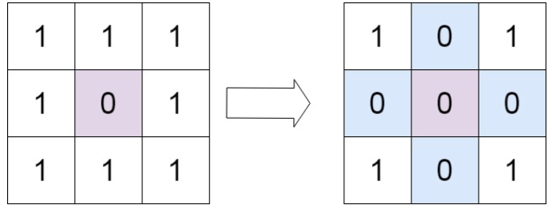
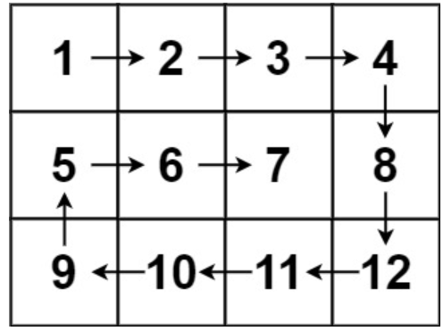
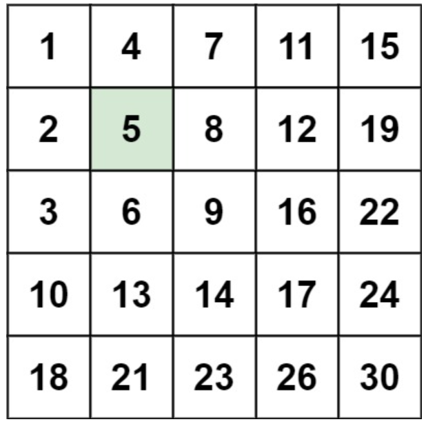

# 五. 普通数组

## 最大子数组和

给你一个整数数组 `nums` ，请你找出一个具有最大和的连续子数组（子数组最少包含一个元素），返回其最大和。

**子数组**是数组中的一个连续部分

**示例 1：**

输入：nums = [-2,1,-3,4,-1,2,1,-5,4]
输出：6
解释：连续子数组 [4,-1,2,1] 的和最大，为 6 

**解答：**

动态规划：

对于遍历到的每一个元素 `nums[i]`，有两种选择：

1. 要么把它接在前面的子数组后面：`maxm+ nums[i]`
2. 要么重新从它自己开始一个子数组：`nums[i]`

cpp：

```cpp
class Solution {
  public:
    int maxSubArray(vector<int> &nums) {
        int n = nums.size();
        if (n < 1)
            return nums[0];
        int ans = nums[0], maxm = nums[0];
        for (int i = 1; i < n; i++) {
            maxm = max(maxm + nums[i], nums[i]);//以当前这个位置结尾的连续子数组的最大和
            ans = max(ans, maxm);//目前为止所有位置中，出现过的最大子数组和
        }
        return ans;
    }
};
```

java：

```java
class Solution {
    public int maxSubArray(int[] nums) {
        int pre = 0, maxAns = nums[0];
        for (int x : nums) {
            pre = Math.max(pre + x, x);
            maxAns = Math.max(maxAns, pre);
        }
        return maxAns;
    }
}
```

## 合并区间

以数组 `intervals` 表示若干个区间的集合，其中单个区间为 `intervals[i] = [starti, endi]` 。请你合并所有重叠的区间，并返回 *一个不重叠的区间数组，该数组需恰好覆盖输入中的所有区间* 。

**示例 1：**

输入：intervals = [[1,3],[2,6],[8,10],[15,18]]
输出：[[1,6],[8,10],[15,18]]
解释：区间 [1,3] 和 [2,6] 重叠, 将它们合并为 [1,6]

**解答：**

**先按左端点从小到大排序所有区间**
这样做的好处是：排完序之后，所有可能重叠的区间一定在相邻位置

**在用一个当前合并区间 [l, r] 从左到右扫一遍**
遍历排序后的每个区间 `[lt, rt]`：

- 如果当前区间和 `[l, r]` **有重叠**（即 `r >= lt`）
  那么它们可以合并，更新右端点：
  `r= max(r, rt)`
- 如果 **没有重叠**（即 `r < lt`）
  说明前面的 `[l, r]` 已经“结束”了，可以把它加入答案，然后把当前区间作为新的 `[curL, curR]` 开始

遍历结束之后，**别忘了把最后一个 [curL, curR] 加入答案**

cpp：

```cpp
class Solution {
  public:
    vector<vector<int>> merge(vector<vector<int>> &intervals) {
        if (intervals.size() == 1)
            return intervals;
        vector<vector<int>> ans;
        sort(intervals.begin(), intervals.end(),
             [](const vector<int> &a, const vector<int> &b) {
                 return a[0] < b[0];
             });
        int l = intervals[0][0], r = intervals[0][1];
        for (int i = 1; i < intervals.size(); i++) {
            int lt = intervals[i][0];
            int rt = intervals[i][1];
            if (r >= lt) {
                r = max(r, rt);
            } else {
                ans.push_back({l, r});
                l = lt;
                r = rt;
            }
        }
        ans.push_back({l, r});
        return ans;
    }
};
```

java：

```java
class Solution {
    public int[][] merge(int[][] intervals) {
        if (intervals.length == 0) {
            return new int[0][2];
        }
        Arrays.sort(intervals, new Comparator<int[]>() {
            public int compare(int[] interval1, int[] interval2) {
                return interval1[0] - interval2[0];
            }
        });
        List<int[]> merged = new ArrayList<int[]>();
        for (int i = 0; i < intervals.length; ++i) {
            int L = intervals[i][0], R = intervals[i][1];
            if (merged.size() == 0 || merged.get(merged.size() - 1)[1] < L) {
                merged.add(new int[]{L, R});
            } else {
                merged.get(merged.size() - 1)[1] = Math.max(merged.get(merged.size() - 1)[1], R);
            }
        }
        return merged.toArray(new int[merged.size()][]);
    }
}
```

## 轮转数组

给定一个整数数组 `nums`，将数组中的元素向右轮转 `k` 个位置，其中 `k` 是非负数。

**示例 1:**

输入: nums = [1,2,3,4,5,6,7], k = 3
输出: [5,6,7,1,2,3,4]
解释:
向右轮转 1 步: [7,1,2,3,4,5,6]
向右轮转 2 步: [6,7,1,2,3,4,5]
向右轮转 3 步: [5,6,7,1,2,3,4]

**解答：**

向右轮转 `k` 步，等价于：

1. 先整体翻转整个数组
2. 再翻转前 `k` 个元素
3. 最后翻转剩余的 `n - k` 个元素

在代码上实现时，需要注意两个关键点：

1. `k` 可能大于数组长度 `n`，需要先化简：
   `k = k % n;`
   因为旋转 `n` 步相当于回到原数组。
2. 实现一个小的反转函数，用来反转数组指定区间 `[l, r]`

cpp：

```cpp
class Solution {
  public:
    // 辅助函数：反转 nums[l..r] 这一段
    void reverseRange(vector<int> &nums, int l, int r) {
        while (l < r) {
            // 交换左右两个元素
            int tmp = nums[l];
            nums[l] = nums[r];
            nums[r] = tmp;
            ++l;
            --r;
        }
    }
    void rotate(vector<int> &nums, int k) {
        int n = nums.size();
        k %= n; // 化简步数，避免多余旋转
        if (k == 0)
            return; // 旋转 n 的倍数，相当于不变
        // 第一步：整体翻转
        reverseRange(nums, 0, n - 1);
        // 第二步：翻转前 k 个元素
        reverseRange(nums, 0, k - 1);
        // 第三步：翻转剩余的 n - k 个元素
        reverseRange(nums, k, n - 1);
    }
};
```

java：

```java
class Solution {
    public void rotate(int[] nums, int k) {
        k %= nums.length;
        reverse(nums, 0, nums.length - 1);
        reverse(nums, 0, k - 1);
        reverse(nums, k, nums.length - 1);
    }

    public void reverse(int[] nums, int start, int end) {
        while (start < end) {
            int temp = nums[start];
            nums[start] = nums[end];
            nums[end] = temp;
            start += 1;
            end -= 1;
        }
    }
}
```

## 除自身以外数组的乘积

给你一个整数数组 `nums`，返回 数组 `answer` ，其中 `answer[i]` 等于 `nums` 中除 `nums[i]` 之外其余各元素的乘积 。

题目数据 **保证** 数组 `nums`之中任意元素的全部前缀元素和后缀的乘积都在  **32 位** 整数范围内。

请 **不要使用除法，**且在 `O(n)` 时间复杂度内完成此题。

**示例 1:**

输入: nums = [1,2,3,4]
输出: [24,12,8,6]

**解答：**

第一遍 从左往右 计算前缀乘积

建立数组 `answer`，初值全为 1。

从左到右遍历，用变量 `prefix` 记录「到当前下标之前所有数的乘积」，一开始 `prefix = 1`

- 每到一个位置 i，先把当前的 `prefix` 存进 `answer[i]`
  此时 `answer[i]` 就等于下标小于 i 的所有元素的乘积
- 然后更新 `prefix *= nums[i]`，为下一个位置准备

遍历完后，`answer[i]` 里存的就是每个位置的前缀乘积 `pre[i]`。

二 第二遍 从右往左 乘上后缀乘积

再从右往左遍历，用变量 `suffix` 记录「到当前下标之后所有数的乘积」，一开始 `suffix = 1`

- 每到一个位置 i，用 `answer[i] *= suffix`
  **原来的 `answer[i]` 是 `pre[i]`，乘上 `suffix` 这个后缀乘积之后，就变成 `pre[i] * suf[i]`，也就是题目要求的答案**
- 然后更新 `suffix *= nums[i]`，为前一个位置准备

这样两趟扫描之后，`answer` 就是最终结果

cpp：

```cpp
class Solution {
  public:
    vector<int> productExceptSelf(vector<int> &nums) {
        int n = nums.size();
        vector<int> answer(n, 1); // 先全部初始化为 1
        // 第一遍 从左到右 计算前缀乘积
        int prefix = 1; // prefix 表示当前位置左边所有元素的乘积
        for (int i = 0; i < n; ++i) {
            // 此时 prefix 就是 nums[0..i-1] 的乘积
            answer[i] = prefix;
            // 然后把当前元素乘进去 给下一个位置用
            prefix *= nums[i];
        }
        // 第二遍 从右到左 乘上后缀乘积
        int suffix = 1; // suffix 表示当前位置右边所有元素的乘积
        for (int i = n - 1; i >= 0; --i) {
            // 此时 suffix 是 nums[i+1..n-1] 的乘积
            answer[i] *= suffix; // 原来是前缀乘积 再乘后缀乘积
            // 然后把当前元素乘进去 给前一个位置用
            suffix *= nums[i];
        }
        return answer;
    }
};
```

java：

```java
class Solution {
    public int[] productExceptSelf(int[] nums) {
        int length = nums.length;
        int[] answer = new int[length];

        // answer[i] 表示索引 i 左侧所有元素的乘积
        // 因为索引为 '0' 的元素左侧没有元素， 所以 answer[0] = 1
        answer[0] = 1;
        for (int i = 1; i < length; i++) {
            answer[i] = nums[i - 1] * answer[i - 1];
        }

        // R 为右侧所有元素的乘积
        // 刚开始右边没有元素，所以 R = 1
        int R = 1;
        for (int i = length - 1; i >= 0; i--) {
            // 对于索引 i，左边的乘积为 answer[i]，右边的乘积为 R
            answer[i] = answer[i] * R;
            // R 需要包含右边所有的乘积，所以计算下一个结果时需要将当前值乘到 R 上
            R *= nums[i];
        }
        return answer;
    }
}
```

## 缺失的第一个正数

给你一个未排序的整数数组 `nums` ，请你找出其中没有出现的最小的正整数

请你实现时间复杂度为 O(n)，并且只使用常数级别额外空间的解决方案

**示例 1：**

输入：nums = [1,2,0]
输出：3
解释：范围 [1,2] 中的数字都在数组中

**示例 2：**

输入：nums = [3,4,-1,1]
输出：2
解释：1 在数组中，但 2 没有

**解答：**

设数组长度为 n，可以证明，答案一定在区间`1 到 n+1`之内

也就是说，只要找到 1 到 n 中哪个最小的数没有出现就行；如果 1 到 n 都出现了，那么答案就是 n+1

为了利用 O(1) 空间，我们在原数组上做“就地重排”，尽量让数字 i 出现在下标 i−1 的位置：

- 理想状态：
  `nums[0] = 1`，`nums[1] = 2`，…，`nums[i] = i+1`
- 那么从左到右扫描，找到第一个不满足 `nums[i] == i+1` 的位置 i，对应的答案就是 i+1
- 如果所有位置都满足 `nums[i] == i+1`，说明 1..n 都在数组中，答案是 n+1

怎样把数字放回“应该在的位置”？
对于每个下标 i，我们检查当前的 `nums[i]`：

1. 如果 `nums[i]` 在 1 到 n 之间（即 `1 <= nums[i] <= n`），并且它应该待在的下标位置是 `nums[i] - 1`
2. 如果 `nums[i]` 和它应该去的位置上的元素 `nums[nums[i] - 1]` 不相等
   就交换这两个位置上的元素，把当前数尽量放回正确的位置

另外条件必须严格判断：
`while (nums[i] >= 1 && nums[i] <= n && nums[nums[i] - 1] != nums[i])`
这样可以避免死循环，例如有重复元素时

cpp：

```cpp
class Solution {
  public:
    int firstMissingPositive(vector<int> &nums) {
        int n = nums.size();
        // 第一步：把数字尽量放到自己“该在”的位置上
        for (int i = 0; i < n; ++i) {
            // 当 nums[i] 在 [1, n] 范围内，并且不在正确位置上时，
            // 就尝试把它交换到 nums[nums[i] - 1] 的位置
            while (nums[i] >= 1 && nums[i] <= n &&
                   nums[nums[i] - 1] != nums[i]) {
                int correctIndex = nums[i] - 1; // 该数应该去的下标
                // 交换 nums[i] 和 nums[correctIndex]
                int tmp = nums[i];
                nums[i] = nums[correctIndex];
                nums[correctIndex] = tmp;
            }
        }
        // 第二步：扫描一遍，找到第一个不满足 nums[i] == i + 1 的位置
        for (int i = 0; i < n; ++i) {
            if (nums[i] != i + 1) {
                // 说明 i + 1 这个正数不存在
                return i + 1;
            }
        }
        // 如果 1..n 全部都在数组中，则答案是 n + 1
        return n + 1;
    }
};
```

java：

```java
class Solution {
    public int firstMissingPositive(int[] nums) {
        int n = nums.length;
        for (int i = 0; i < n; ++i) {
            while (nums[i] > 0 && nums[i] <= n && nums[nums[i] - 1] != nums[i]) {
                int temp = nums[nums[i] - 1];
                nums[nums[i] - 1] = nums[i];
                nums[i] = temp;
            }
        }
        for (int i = 0; i < n; ++i) {
            if (nums[i] != i + 1) {
                return i + 1;
            }
        }
        return n + 1;
    }
}
```

# 六. 矩阵

## 矩阵置零

给定一个 `m x n` 的矩阵，如果一个元素为 **0** ，则将其所在行和列的所有元素都设为 **0** 。请使用 **原地** 算法**。**


**示例 1：**



输入：matrix = [[1,1,1],[1,0,1],[1,1,1]]
输出：[[1,0,1],[0,0,0],[1,0,1]]

**解答：**

cpp：

```cpp
class Solution {
  public:
    void setZeroes(vector<vector<int>> &matrix) {
        int m = matrix.size();
        int n = matrix[0].size();
        // 记录第一行、第一列是否需要整体置 0
        bool row0 = false; // 第一行是否需要清零
        bool col0 = false; // 第一列是否需要清零
        // 检查第一列是否存在 0，如果有，则之后整列要清零
        for (int i = 0; i < m; ++i) {
            if (matrix[i][0] == 0) {
                col0 = true;
                break;
            }
        }
        // 检查第一行是否存在 0，如果有，则之后整行要清零
        for (int j = 0; j < n; ++j) {
            if (matrix[0][j] == 0) {
                row0 = true;
                break;
            }
        }
        // 利用第一行和第一列作为“标记行”和“标记列”
        // 扫描剩余单元，一旦发现 0，就在对应的行首、列首打标记
        for (int i = 1; i < m; ++i) {
            for (int j = 1; j < n; ++j) {
                if (matrix[i][j] == 0) {
                    matrix[i][0] = 0; // 标记第 i 行
                    matrix[0][j] = 0; // 标记第 j 列
                }
            }
        }
        // 根据标记，将除第一行、第一列之外的单元格置 0
        for (int i = 1; i < m; ++i) {
            for (int j = 1; j < n; ++j) {
                // 只要这一行或这一列被标记为 0，该位置就设为 0
                if (matrix[i][0] == 0 || matrix[0][j] == 0) {
                    matrix[i][j] = 0;
                }
            }
        }
        // 最后处理第一行：如果一开始记录需要清零，则整行置 0
        if (row0) {
            for (int j = 0; j < n; ++j) {
                matrix[0][j] = 0;
            }
        }
        // 最后处理第一列：如果一开始记录需要清零，则整列置 0
        if (col0) {
            for (int i = 0; i < m; ++i) {
                matrix[i][0] = 0;
            }
        }
    }
};
```

java：

```java
class Solution {
    public void setZeroes(int[][] matrix) {
        int m = matrix.length, n = matrix[0].length;
        boolean flagCol0 = false;
        for (int i = 0; i < m; i++) {
            if (matrix[i][0] == 0) {
                flagCol0 = true;
            }
            for (int j = 1; j < n; j++) {
                if (matrix[i][j] == 0) {
                    matrix[i][0] = matrix[0][j] = 0;
                }
            }
        }
        for (int i = m - 1; i >= 0; i--) {
            for (int j = 1; j < n; j++) {
                if (matrix[i][0] == 0 || matrix[0][j] == 0) {
                    matrix[i][j] = 0;
                }
            }
            if (flagCol0) {
                matrix[i][0] = 0;
            }
        }
    }
}
```

## 螺旋矩阵

给你一个 `m` 行 `n` 列的矩阵 `matrix` ，请按照 **顺时针螺旋顺序** ，返回矩阵中的所有元素

**示例：**



输入：matrix = [[1,2,3,4],[5,6,7,8],[9,10,11,12]]
输出：[1,2,3,4,8,12,11,10,9,5,6,7]

**解答：**

cpp：

```cpp
class Solution {
  public:
    vector<int> spiralOrder(vector<vector<int>> &matrix) {
        int m = matrix.size();
        if (m == 0)
            return {};
        int n = matrix[0].size();
        if (n == 0)
            return {};
        int top = 0, bottom = m - 1;
        int left = 0, right = n - 1;
        vector<int> ans;
        ans.reserve(m * n);
        while (top <= bottom && left <= right) {
            // 从左到右
            for (int j = left; j <= right; ++j) {
                ans.push_back(matrix[top][j]);
            }
            ++top; // 上边界下移
            if (top > bottom)
                break; // 只剩一行时可能结束
            // 从上到下
            for (int i = top; i <= bottom; ++i) {
                ans.push_back(matrix[i][right]);
            }
            --right; // 右边界左移
            if (left > right)
                break; // 只剩一列时可能结束
            // 从右到左
            for (int j = right; j >= left; --j) {
                ans.push_back(matrix[bottom][j]);
            }
            --bottom; // 下边界上移
            if (top > bottom)
                break;
            // 从下到上
            for (int i = bottom; i >= top; --i) {
                ans.push_back(matrix[i][left]);
            }
            ++left; // 左边界右移
        }
        return ans;
    }
};
```

java：

```java
class Solution {
    public List<Integer> spiralOrder(int[][] matrix) {
        List<Integer> ans = new ArrayList<>();
        if (matrix == null || matrix.length == 0 || matrix[0].length == 0) {
            return ans;
        }
        int m = matrix.length, n = matrix[0].length;
        int top = 0, bottom = m - 1;
        int left = 0, right = n - 1;

        while (top <= bottom && left <= right) {
            for (int j = left; j <= right; ++j) {
                ans.add(matrix[top][j]);
            }
            ++top;
            if (top > bottom) break;

            for (int i = top; i <= bottom; ++i) {
                ans.add(matrix[i][right]);
            }
            --right;
            if (left > right) break;

            for (int j = right; j >= left; --j) {
                ans.add(matrix[bottom][j]);
            }
            --bottom;
            if (top > bottom) break;
            for (int i = bottom; i >= top; --i) {
                ans.add(matrix[i][left]);
            }
            ++left;
        }
        return ans;
    }
}
```

## 旋转图像

给定一个 *n* × *n* 的二维矩阵 `matrix` 表示一个图像。请你将图像顺时针旋转 90 度。

你必须在 **原地** 旋转图像，这意味着你需要直接修改输入的二维矩阵。**请不要** 使用另一个矩阵来旋转图像。

**示例 1：**

输入：matrix = [[1,2,3],[4,5,6],[7,8,9]]
输出：[[7,4,1],[8,5,2],[9,6,3]]

**解答：**

先将矩阵进行转置，在对每行进行反转：

1，2，3	     1，4，7		     7，4，1
4，5，6 	-> 2，5，8		-> 8，5，2
7，8，9	     3，6，9		     9，6，3

cpp：

```cpp
class Solution {
public:
    void rotate(vector<vector<int>>& matrix) {
        int n = matrix.size();
        if (n == 0) return;
        // 第一步：转置矩阵（沿主对角线对称）
        for (int i = 0; i < n; ++i) {
            for (int j = i + 1; j < n; ++j) {
                swap(matrix[i][j], matrix[j][i]);
            }
        }
        // 第二步：每一行左右反转
        for (int i = 0; i < n; ++i) {
            int l = 0, r = n - 1;
            while (l < r) {
                swap(matrix[i][l], matrix[i][r]);
                ++l;
                --r;
            }
        }
    }
};
```

java：

```java 
class Solution {
    public void rotate(int[][] matrix) {
        int n = matrix.length;
        if (n == 0) return;
        for (int i = 0; i < n; ++i) {
            for (int j = i + 1; j < n; ++j) {
                int tmp = matrix[i][j];
                matrix[i][j] = matrix[j][i];
                matrix[j][i] = tmp;
            }
        }
        for (int i = 0; i < n; ++i) {
            int l = 0, r = n - 1;
            while (l < r) {
                int tmp = matrix[i][l];
                matrix[i][l] = matrix[i][r];
                matrix[i][r] = tmp;
                ++l;
                --r;
            }
        }
    }
}
```

## 搜素二维矩阵 II

编写一个高效的算法来搜索 `m x n` 矩阵 `matrix` 中的一个目标值 `target` 。该矩阵具有以下特性：

- 每行的元素从左到右升序排列。
- 每列的元素从上到下升序排列

**示例：**



输入：matrix = [[1,4,7,11,15],[2,5,8,12,19],[3,6,9,16,22],[10,13,14,17,24],[18,21,23,26,30]], target = 5
输出：true

**解答：**

cpp：

```cpp
class Solution {
public:
    bool searchMatrix(vector<vector<int>>& matrix, int target) {
        int m = matrix.size();
        if (m == 0) return false;
        int n = matrix[0].size();
        if (n == 0) return false;
        int i = 0;
        int j = n - 1;
        while (i < m && j >= 0) {
            int x = matrix[i][j];
            if (x == target) {
                return true;
            } else if (x > target) {
                j--;
            } else {
                i++;
            }
        }
        return false;
    }
};
```

java：

```java
class Solution {
    public boolean searchMatrix(int[][] matrix, int target) {
        int m = matrix.length, n = matrix[0].length;
        int x = 0, y = n - 1;
        while (x < m && y >= 0) {
            if (matrix[x][y] == target) {
                return true;
            }
            if (matrix[x][y] > target) {
                --y;
            } else {
                ++x;
            }
        }
        return false;
    }
}
```


