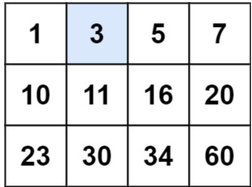
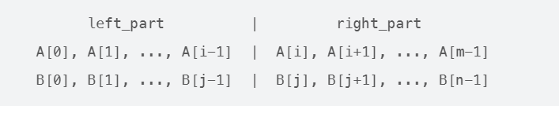

# 十一. 二分查找

## 搜索插入位置

给定一个排序数组和一个目标值，在数组中找到目标值，并返回其索引。如果目标值不存在于数组中，返回它将会被按顺序插入的位置。

请必须使用时间复杂度为 `O(log n)` 的算法。

**示例 1:**

输入: nums = [1,3,5,6], target = 5
输出: 2

**示例 2:**

输入: nums = [1,3,5,6], target = 2
输出: 1

**解答：**

这题等价于找一个大于等于target的位置

cpp：

```cpp
class Solution {
  public:
    int searchInsert(vector<int> &nums, int target) {
        int l = 0, r = nums.size();
        while (l < r) {
            int mid = l + (r - l) / 2;
            if (nums[mid] >= target)
                r = mid;
            else
                l = mid + 1;
        }
        return l;
    }
};
```

java：

```java
class Solution {
    public int searchInsert(int[] nums, int target) {
        int n = nums.length;
        int left = 0, right = n - 1, ans = n;
        while (left <= right) {
            int mid = ((right - left) >> 1) + left;
            if (target <= nums[mid]) {
                ans = mid;
                right = mid - 1;
            } else {
                left = mid + 1;
            }
        }
        return ans;
    }
}
```

## 搜索二维矩阵

给你一个满足下述两条属性的 `m x n` 整数矩阵：

- 每行中的整数从左到右按非严格递增顺序排列。
- 每行的第一个整数大于前一行的最后一个整数。

给你一个整数 `target` ，如果 `target` 在矩阵中，返回 `true` ；否则，返回 `false` 

**示例：**



输入：matrix = [[1,3,5,7],[10,11,16,20],[23,30,34,60]], target = 3
输出：true

**解答：**

- 条件一 每行从左到右非严格递增
- 条件二 每行第一个数大于前一行最后一个数

这两个条件合起来等价于说：如果把矩阵按行展开成一维数组，整体就是一个升序数组

所以我们可以在下标从 0 到 m * n − 1 的这个“虚拟一维数组”上做标准二分，只是访问元素时要从一维下标映射回二维下标。

映射关系：
设一共有 m 行 n 列，虚拟一维下标为 idx，则

- 行号 row = idx / n
- 列号 col = idx % n
- 对应元素就是 $matrix[row][col]$

cpp：

```cpp
class Solution {
  public:
    bool searchMatrix(vector<vector<int>> &matrix, int target) {
        int m = matrix.size();    // 行数
        int n = matrix[0].size(); // 列数
        // 在虚拟的一维数组 [0, m * n - 1] 上做二分
        int left = 0;
        int right = m * n - 1;  // 闭区间 [left, right]
        while (left <= right) { // 闭区间非空的条件是 left <= right
            int mid = left + ((right - left) >> 1);
            // 把一维下标 mid 映射回二维下标
            int row = mid / n; // 第 mid / n 行
            int col = mid % n; // 第 mid % n 列
            int val = matrix[row][col];
            if (val == target)
                return true; // 找到了
            else if (val < target)
                left = mid + 1;
            else
                right = mid - 1;
        }
        return false;
    }
};
```

java：

```java
class Solution {
    public boolean searchMatrix(int[][] matrix, int target) {
        int m = matrix.length;
        if (m == 0) return false;
        int n = matrix[0].length;
        if (n == 0) return false;
        int left = 0;
        int right = m * n - 1;
        while (left <= right) {
            int mid = left + (right - left) / 2;
            int row = mid / n;
            int col = mid % n;
            int val = matrix[row][col];
            if (val == target) {
                return true;
            } else if (val < target) {
                left = mid + 1;
            } else {
                right = mid - 1;
            }
        }
        return false;
    }
}
```

## 在排序数组中查找元素的第一个和最后一个位置

给你一个按照非递减顺序排列的整数数组 `nums`，和一个目标值 `target`。请你找出给定目标值在数组中的开始位置和结束位置。

如果数组中不存在目标值 `target`，返回 `[-1, -1]`。

你必须设计并实现时间复杂度为 `O(log n)` 的算法解决此问题。

**解答：**

寻找第一个大于等于target题目的变种：

​	1.尝试找第一个大于等于target的位置（左边界L）：

​		1.`L == n`，意味着越界，返回{-1,-1}

​		2.`nums[L] != target`，意味着没找到，直接返回{-1,-1}

​	2.找到左边界了，寻找第一个大于等于target+1的位置，    `R = bsearch(nums, target + 1) - 1` 

cpp：

```cpp
class Solution {
  public:
    int bsearch(vector<int> &nums, int x) {
        int n = nums.size();
        int l = 0, r = n;
        while (l < r) {
            int mid = l + ((r - l) >> 1);
            if (nums[mid] >= x)
                r = mid;
            else
                l = mid + 1;
        }
        return l;
    }
    vector<int> searchRange(vector<int> &nums, int target) {
        int n = nums.size();
        if (!n)
            return {-1, -1};
        int l = bsearch(nums, target);
        if (l == n || nums[l] != target)
            return {-1, -1};
        int r = bsearch(nums, target + 1) - 1;
        return {l, r};
    }
};
```

java：

```java
class Solution {
    public int[] searchRange(int[] nums, int target) {
        int leftIdx = binarySearch(nums, target, true);
        int rightIdx = binarySearch(nums, target, false) - 1;
        if (leftIdx <= rightIdx && rightIdx < nums.length && nums[leftIdx] == target && nums[rightIdx] == target) {
            return new int[]{leftIdx, rightIdx};
        } 
        return new int[]{-1, -1};
    }

    public int binarySearch(int[] nums, int target, boolean lower) {
        int left = 0, right = nums.length - 1, ans = nums.length;
        while (left <= right) {
            int mid = (left + right) / 2;
            if (nums[mid] > target || (lower && nums[mid] >= target)) {
                right = mid - 1;
                ans = mid;
            } else {
                left = mid + 1;
            }
        }
        return ans;
    }
}
```

## 搜索旋转排序数组

整数数组 `nums` 按升序排列，数组中的值 **互不相同** 。

在传递给函数之前，`nums` 在预先未知的某个下标 `k`（`0 <= k < nums.length`）上进行了 **向左旋转**，使数组变为 `[nums[k], nums[k+1], ..., nums[n-1], nums[0], nums[1], ..., nums[k-1]]`（下标 **从 0 开始** 计数）。例如， `[0,1,2,4,5,6,7]` 下标 `3` 上向左旋转后可能变为 `[4,5,6,7,0,1,2]` 。

给你 **旋转后** 的数组 `nums` 和一个整数 `target` ，如果 `nums` 中存在这个目标值 `target` ，则返回它的下标，否则返回 `-1` 。

你必须设计一个时间复杂度为 `O(log n)` 的算法解决此问题。

**示例 1：**

输入：nums = [4,5,6,7,0,1,2], target = 0
输出：4

**解答：**

虽然整体不是单调的，但任意时刻至少有一半区间是有序的，我们只要判断哪一半有序，再判断目标值是否落在那一半，就可以把区间砍掉一半

cpp：

```cpp
class Solution {
  public:
    int search(vector<int> &nums, int target) {
        int n = nums.size();
        int l = 0, r = n - 1;
        while (l <= r) {
            int mid = l + ((r - l) >> 1);
            if (nums[mid] == target)
                return mid;
            if (nums[l] <= nums[mid]) {
                if (target < nums[mid] && target >= nums[l])
                    r = mid - 1;
                else
                    l = mid + 1;
            } else {
                if (target > nums[mid] && target <= nums[r])
                    l = mid + 1;
                else
                    r = mid - 1;
            }
        }
        return -1;
    }
};
```

java：

```java
class Solution {
    public int search(int[] nums, int target) {
        int n = nums.length;
        if (n == 0) {
            return -1;
        }
        if (n == 1) {
            return nums[0] == target ? 0 : -1;
        }
        int l = 0, r = n - 1;
        while (l <= r) {
            int mid = (l + r) / 2;
            if (nums[mid] == target) {
                return mid;
            }
            if (nums[0] <= nums[mid]) {
                if (nums[0] <= target && target < nums[mid]) {
                    r = mid - 1;
                } else {
                    l = mid + 1;
                }
            } else {
                if (nums[mid] < target && target <= nums[n - 1]) {
                    l = mid + 1;
                } else {
                    r = mid - 1;
                }
            }
        }
        return -1;
    }
}
```

## 寻找旋转排序数组中的最小值

已知一个长度为 n的数组，预先按照升序排列，经由 1 到 n 次 旋转 后，得到输入数组。例如，原数组 nums = [0,1,2,4,5,6,7]在变化后可能得到：

- 若旋转 `4` 次，则可以得到 `[4,5,6,7,0,1,2]`
- 若旋转 `7` 次，则可以得到 `[0,1,2,4,5,6,7]`

注意，数组 `[a[0], a[1], a[2], ..., a[n-1]]` **旋转一次** 的结果为数组 `[a[n-1], a[0], a[1], a[2], ..., a[n-2]]` 。

给你一个元素值 **互不相同** 的数组 `nums` ，它原来是一个升序排列的数组，并按上述情形进行了多次旋转。请你找出并返回数组中的 **最小元素** 。

你必须设计一个时间复杂度为 `O(log n)` 的算法解决此问题。

**示例 1：**

输入：nums = [3,4,5,1,2]
输出：1
解释：原数组为 [1,2,3,4,5] ，旋转 3 次得到输入数组

**解答：**

cpp：

```cpp
class Solution {
  public:
    int findMin(vector<int> &nums) {
        int n = nums.size();
        int left = 0, right = n - 1;

        while (left < right) {
            int mid = left + (right - left) / 2;

            if (nums[mid] <= nums[right]) {
                // 右半部分有序，最小值一定在 [left, mid] 里
                right = mid;
            } else {
                // nums[mid] > nums[right]
                // 最小值一定在 (mid, right] 里
                left = mid + 1;
            }
        }
        return nums[left];
    }
};

```

java：

```java
class Solution {
    public int findMin(int[] nums) {
        int low = 0;
        int high = nums.length - 1;
        while (low < high) {
            int pivot = low + (high - low) / 2;
            if (nums[pivot] < nums[high]) {
                high = pivot;
            } else {
                low = pivot + 1;
            }
        }
        return nums[low];
    }
}
```

## 寻找两个正序数组的中位数

给定两个大小分别为 `m` 和 `n` 的正序（从小到大）数组 `nums1` 和 `nums2`。请你找出并返回这两个正序数组的 **中位数** 

算法的时间复杂度应该为 `O(log (m+n))`

**示例 1：**

输入：nums1 = [1,3], nums2 = [2]
输出：2.00000
解释：合并数组 = [1,2,3] ，中位数 2

**示例 2：**

输入：nums1 = [1,2], nums2 = [3,4]
输出：2.50000
解释：合并数组 = [1,2,3,4] ，中位数 (2 + 3) / 2 = 2.5

**解答：**

首先不能使用合并排序，因为O(m+n)超了题目要求

既然合并不行，那就看看能不能拆：在两个数组中间“各切一刀”，把它们分成左半部分和右半部分，使得：

1. 左半部分的元素**个数等于**右半部分，或者多一个
2. 左半部分所有**元素都小于等于**右半部分所有元素

这时候：

- 如果**总长度是奇数，中位数就是左半部分整体的最大值**
- 如果**总长度是偶数，中位数就是左半部分整体最大值和右半部分整体最小值的平均值**

**为什么答案就是上面说的那样？**

**因为左半部分整体的最大值一定是这两个数组合并一起后的左半部分的最大值，**

**同样，右半部分最小值也一定是这两个数组合并一起后的右半部分的最小值**

理解了这个，接下来的问题就是该从什么位置进行切分了

我们设：

- 在 nums1 上切的位置是 i
- 在 nums2 上切的位置是 j



切的位置含义是：
nums1 左边有 i 个元素，右边有 m−i 个元素
nums2 左边有 j 个元素，右边有 n−j 个元素

要求左半部分总个数为：`(m+n+1)/2`（这样奇偶统一处理）

所以必须有：`i + j = (m + n + 1) / 2`

这样 **j 就由 i 唯一确定：**`j = (m + n + 1) / 2 − i`

所以我们只需要找到合适的 i 就行了

接着我们需要通过 i 来找最大值和最小值：

显然左半部分整体的最大值是：`max(nums1[i−1], nums2[j−1])`

右半部分最小值是：`min(nums1[i], nums2[j])`

最后只要满足**“左边都不大于右边”**，也就是下面两个条件成立：

1. `nums1[i−1] ≤ nums2[j]`
2. `nums2[j−1] ≤ nums1[i]`

只要找到一个 i，使这两条同时满足，就找到了正确的切分位置，从而得出中位数

**为什么可以用二分？**

我们只需要维护 i 这一个变量，在区间 [0, m] 内变化（可能全部切在 nums1 的左边，也可能一个都不切在 nums1）

对于某个 i：

- 如果` nums1[i−1] > nums2[j]`，说明 nums1 左半边最大值太大了，切得太多了，需要减小 i（往左移）
- 如果` nums2[j−1] > nums1[i]`，说明 nums2 左半边最大值太大，**等价于 i 取太小**，需要增大 i（往右移）

这两个条件和单调性配合，就可以用标准二分，在 [0, m] 内找出唯一正确的 i

同时，为了保证二分的复杂度是 O(log(min(m,n)))，我们应该**让 nums1 是那个更短的数组**，这样二分区间长度是 min(m,n)

边界怎么处理呢？

切的位置 i 可以取 0 或 m，j 也可以取 0 或 n，就会出现 i−1 或 j−1 越界、i 或 j 越界的问题，可以规定：

- 如果 i == 0，说明 nums1 左半部分是空的，没有 nums1[i−1]，我们可以视 nums1[i−1] 为负无穷
- 如果 i == m，说明 nums1 右半部分是空的，没有 nums1[i]，我们可以视 nums1[i] 为正无穷

对 j 同理

cpp：

```cpp
class Solution {
  public:
    double findMedianSortedArrays(vector<int> &nums1, vector<int> &nums2) {
        // 谁小切谁
        if (nums1.size() > nums2.size()) {
            return findMedianSortedArrays(nums2, nums1);
        }

        int m = nums1.size();//一定是小数组
        int n = nums2.size();

        int leftTotal = (m + n + 1) / 2; // 统一奇偶

        int left = 0, right = m;

        //只需要切nums1，nums2根据i的值决定
        while (left <= right) {
            int i = left + (right - left) / 2;
            int j = leftTotal - i; // j由i决定

            // 设定边界
            int nums1LeftMax = (i == 0) ? INT_MIN : nums1[i - 1];//左边界无穷小
            int nums1RightMin = (i == m) ? INT_MAX : nums1[i];//右边界无穷大

            int nums2LeftMax = (j == 0) ? INT_MIN : nums2[j - 1];
            int nums2RightMin = (j == n) ? INT_MAX : nums2[j];

            //满足条件就返回中位数
            if (nums1LeftMax <= nums2RightMin &&
                nums2LeftMax <= nums1RightMin) {
                if ((m + n) % 2 == 1) {
                    // 奇数个返回左半部分最大值
                    return (double)max(nums1LeftMax, nums2LeftMax);
                } else { // 偶数就需要左半部最大值和右半部最小值求平均了
                    int leftMax = max(nums1LeftMax, nums2LeftMax);
                    int rightMin = min(nums1RightMin, nums2RightMin);
                    return (leftMax + rightMin) / 2.0;
                }
            } else if (nums1LeftMax > nums2RightMin) { // nums1[i−1] > nums2[j]，也就是左半部分过大了
                right = i - 1;
            } else { // nums2[j−1] > nums1[i]，也就是右半部分过小了
                left = i + 1;
            }
        }

        return 0.0;
    }
};
```

java：

```java
class Solution {
    public double findMedianSortedArrays(int[] nums1, int[] nums2) {
        if (nums1.length > nums2.length) {
            return findMedianSortedArrays(nums2, nums1);
        }

        int m = nums1.length;
        int n = nums2.length;
        int leftTotal = (m + n + 1) / 2;

        int left = 0, right = m;

        while (left <= right) {
            int i = left + (right - left) / 2;
            int j = leftTotal - i;

            int nums1LeftMax = (i == 0) ? Integer.MIN_VALUE : nums1[i - 1];
            int nums1RightMin = (i == m) ? Integer.MAX_VALUE : nums1[i];

            int nums2LeftMax = (j == 0) ? Integer.MIN_VALUE : nums2[j - 1];
            int nums2RightMin = (j == n) ? Integer.MAX_VALUE : nums2[j];

            if (nums1LeftMax <= nums2RightMin && nums2LeftMax <= nums1RightMin) {
                if (((m + n) & 1) == 1) {
                    return Math.max(nums1LeftMax, nums2LeftMax);
                } else {
                    int leftMax = Math.max(nums1LeftMax, nums2LeftMax);
                    int rightMin = Math.min(nums1RightMin, nums2RightMin);
                    return (leftMax + rightMin) / 2.0;
                }
            } else if (nums1LeftMax > nums2RightMin) {
                right = i - 1;
            } else {
                left = i + 1;
            }
        }

        return 0.0;
    }
}
```

# 十二. 栈


