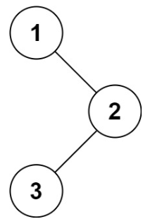

# 八. 二叉树

## 中序遍历

给定一个二叉树的根节点 `root` ，返回它的**中序遍历**

**示例：**



输入：root = [1,null,2,3]
输出：[1,3,2]

cpp：

```cpp
#include <vector>
#include <stack>
using namespace std;
/**
 * Definition for a binary tree node.
 * struct TreeNode {
 *     int val;
 *     TreeNode *left;
 *     TreeNode *right;
 *     TreeNode() : val(0), left(nullptr), right(nullptr) {}
 *     TreeNode(int x) : val(x), left(nullptr), right(nullptr) {}
 *     TreeNode(int x, TreeNode *left, TreeNode *right) : val(x), left(left), right(right) {}
 * };
 */
class Solution {
public:
    vector<int> inorderTraversal(TreeNode* root) {
        vector<int> res;
        stack<TreeNode*> st;
        TreeNode* cur = root;
        while (cur != nullptr || !st.empty()) {
            // 一直往左走，并把沿途节点压栈
            while (cur != nullptr) {
                st.push(cur);
                cur = cur->left;
            }
            // 此时当前节点为空，从栈中弹出一个节点
            cur = st.top();
            st.pop();
            // 访问当前节点
            res.push_back(cur->val);
            // 转向当前节点的右子树
            cur = cur->right;
        }
        return res;
    }
};
```

```cpp
class Solution {
public:
    vector<int> inorderTraversal(TreeNode* root) {
        vector<int> res;
        inorder(root, res);     // 从根节点开始递归中序遍历
        return res;
    }
private:
    void inorder(TreeNode* node, vector<int>& res) {
        if (!node) return;      // 空节点直接返回

        inorder(node->left, res);   // 1 先遍历左子树
        res.push_back(node->val);   // 2 再访问当前节点
        inorder(node->right, res);  // 3 最后遍历右子树
    }
};
```


