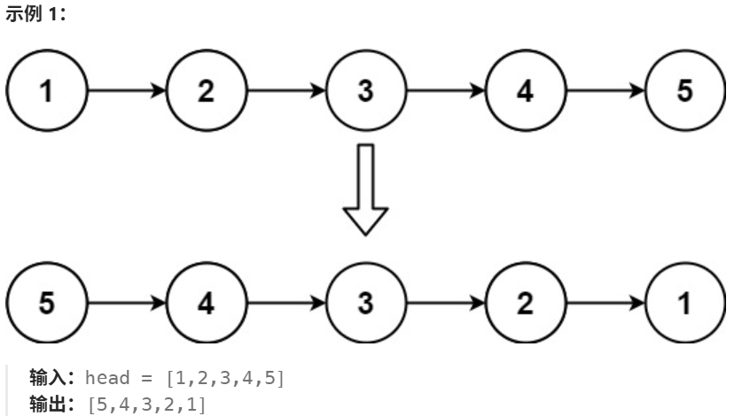
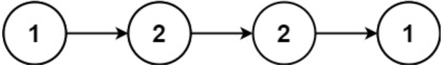

# 七. 链表

## 相交链表

给你两个单链表的头节点 `headA` 和 `headB` ，请你找出并返回两个单链表相交的起始节点。如果两个链表不存在相交节点，返回 `null` 。

图示两个链表在节点 `c1` 开始相交**：**


题目数据 **保证** 整个链式结构中不存在环。

**注意**，函数返回结果后，链表必须 **保持其原始结构** 。

**自定义评测：**

**评测系统** 的输入如下（你设计的程序 **不适用** 此输入）：

- `intersectVal` - 相交的起始节点的值。如果不存在相交节点，这一值为 `0`
- `listA` - 第一个链表
- `listB` - 第二个链表
- `skipA` - 在 `listA` 中（从头节点开始）跳到交叉节点的节点数
- `skipB` - 在 `listB` 中（从头节点开始）跳到交叉节点的节点数

评测系统将根据这些输入创建链式数据结构，并将两个头节点 `headA` 和 `headB` 传递给你的程序。如果程序能够正确返回相交节点，那么你的解决方案将被 **视作正确答案** 。

**解答：**

```java
public class Solution {
    public ListNode getIntersectionNode(ListNode headA, ListNode headB) {
        if (headA == null || headB == null) {
            return null;
        }
        ListNode pA = headA, pB = headB;
        while (pA != pB) {
            pA = pA == null ? headB : pA.next;
            pB = pB == null ? headA : pB.next;
        }
        return pA;
    }
}
```

## 反转链表

给你单链表的头节点 `head` ，请你反转链表，并返回反转后的链表



**解答：**

```java
class Solution {
    public ListNode reverseList(ListNode head) {
        ListNode prev = null;      // 反转后链表的头结点
        ListNode cur = head;       // 当前遍历指针

        while (cur != null) {
            ListNode next = cur.next; // 暂存下一结点
            cur.next = prev;          // 反转指向
            prev = cur;               // prev 前进
            cur = next;               // cur 前进
        }
        return prev;
    }
}

//递归
class Solution {
    public ListNode reverseList(ListNode head) {
        if (head == null || head.next == null) {
            return head;
        }
        ListNode newHead = reverseList(head.next);
        head.next.next = head;
        head.next = null;
        return newHead;
    }
}
```

## 回文链表

给你一个单链表的头节点 `head` ，请你判断该链表是否为回文链表。如果是，返回 `true` ；否则，返回 `false` 



输入：head = [1,2,2,1]
输出：true

**解答：**

快慢指针找到中点 + 反转后半段 + 双指针对比 + 可选恢复链表

```java
class Solution {
    public boolean isPalindrome(ListNode head) {
        if (head == null || head.next == null) return true;

        // 1) 找到中点：slow 最终指向中点（奇数长度）或右半段起点的前一个位置（偶数长度）
        ListNode slow = head, fast = head;
        while (fast != null && fast.next != null) {
            slow = slow.next;
            fast = fast.next.next;
        }

        // 2) 若长度为奇数，slow 需要跳过中间那个结点
        if (fast != null) { // fast 不为空说明是奇数长度
            slow = slow.next;
        }

        // 3) 反转后半段
        ListNode second = reverse(slow);

        // 4) 对比前半段与反转后的后半段
        ListNode p1 = head, p2 = second;
        boolean ok = true;
        while (p2 != null) { // 后半段更短或相等
            if (p1.val != p2.val) {
                ok = false;
                break;
            }
            p1 = p1.next;
            p2 = p2.next;
        }

        // 5) 可选：恢复链表结构（面试中加分，LeetCode 通常不强制）
        reverse(second);

        return ok;
    }

    private ListNode reverse(ListNode head) {
        ListNode prev = null, cur = head;
        while (cur != null) {
            ListNode next = cur.next;
            cur.next = prev;
            prev = cur;
            cur = next;
        }
        return prev;
    }
}
```


